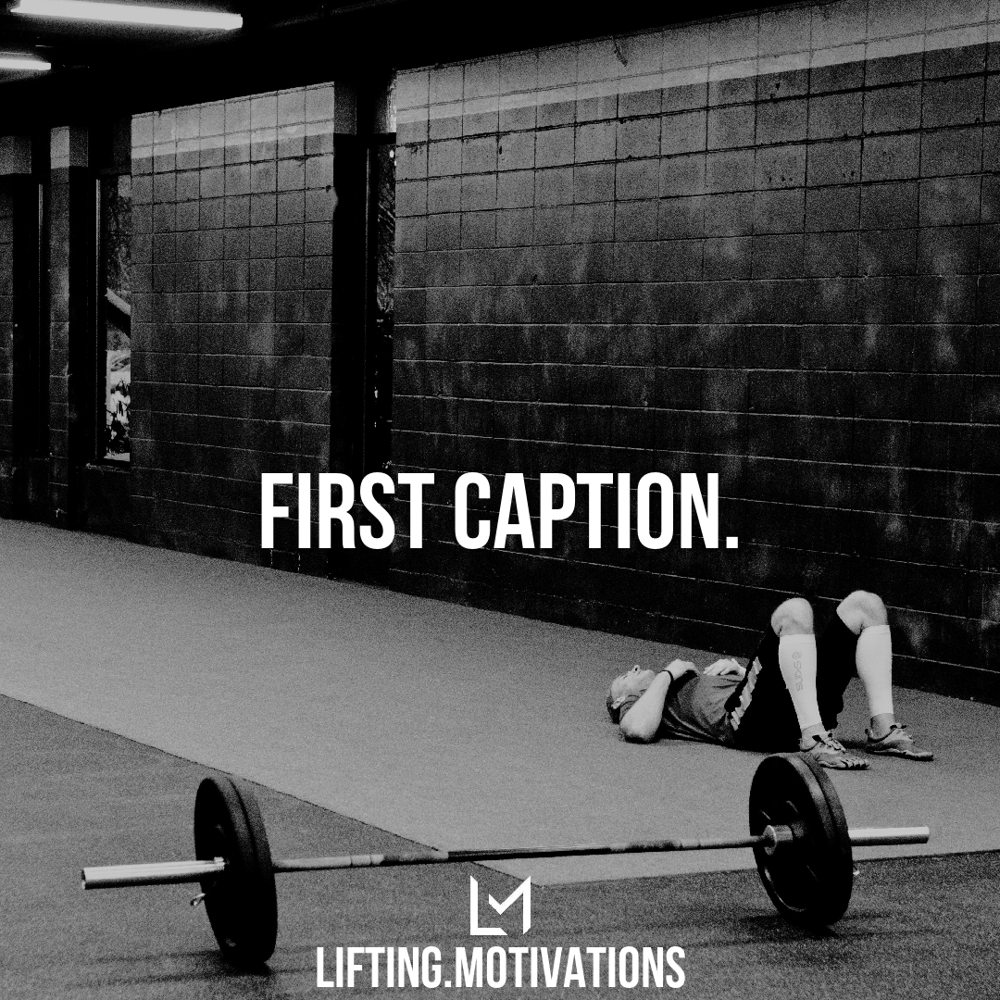
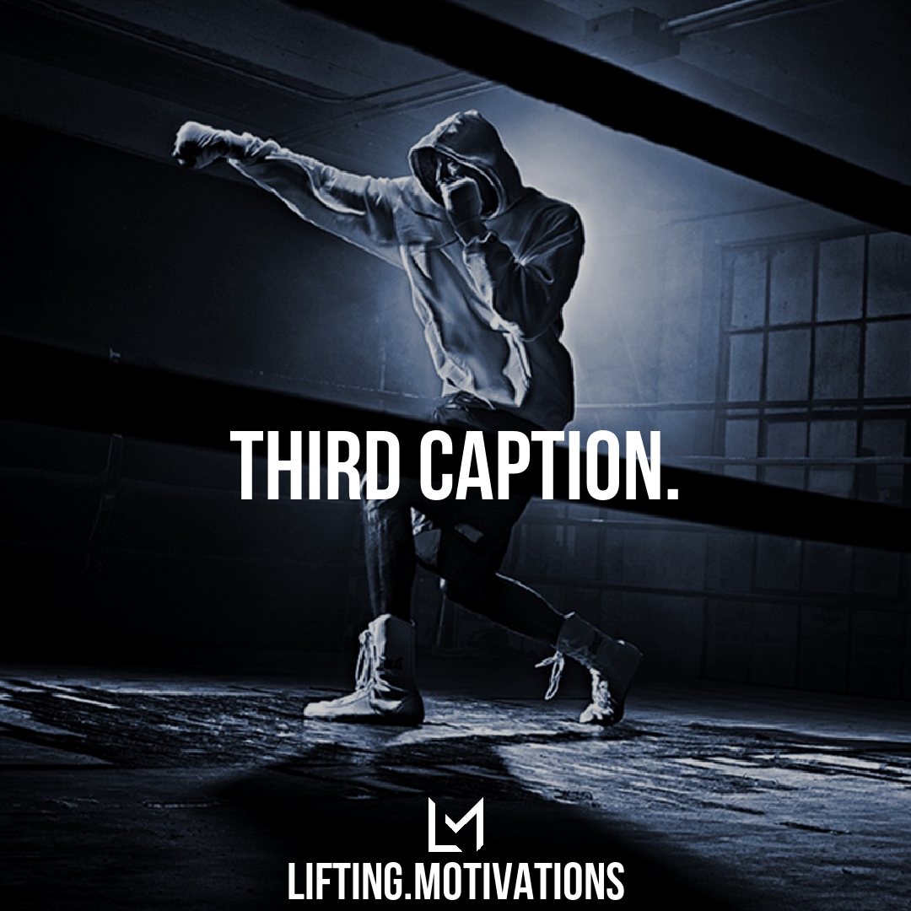
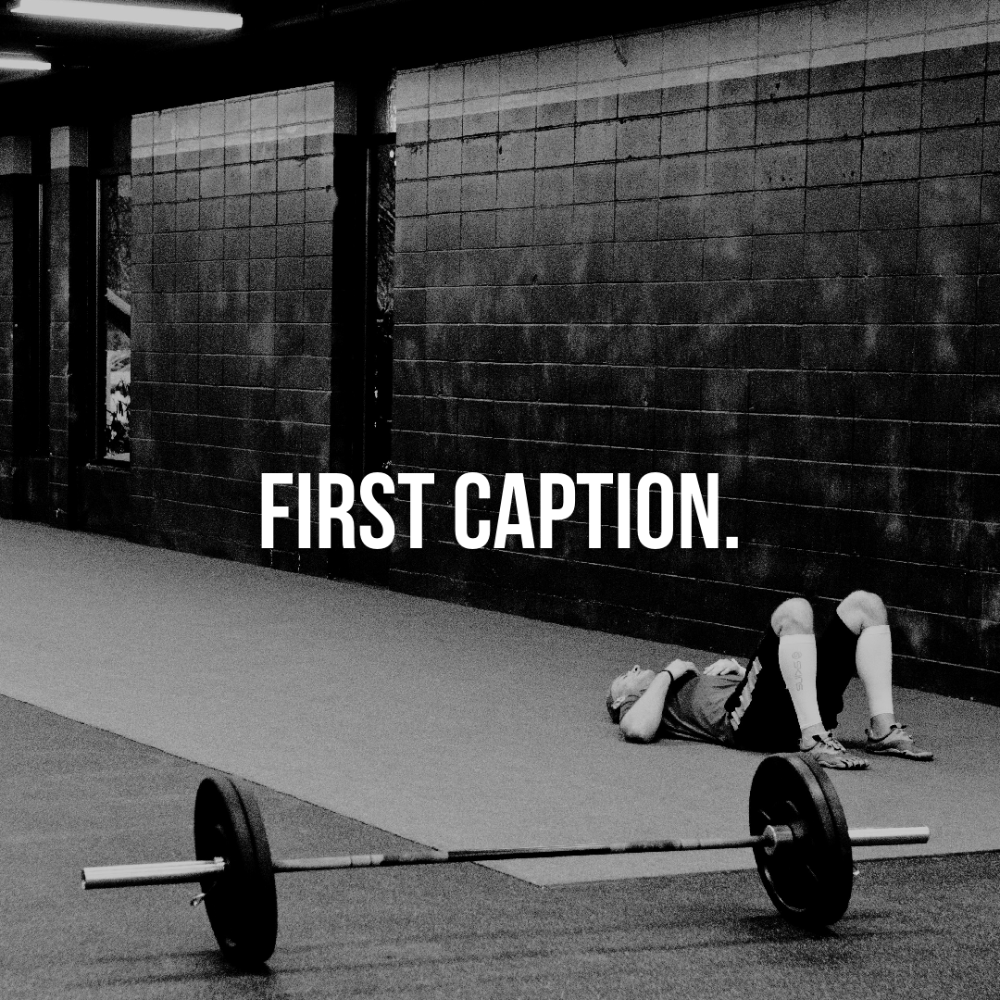
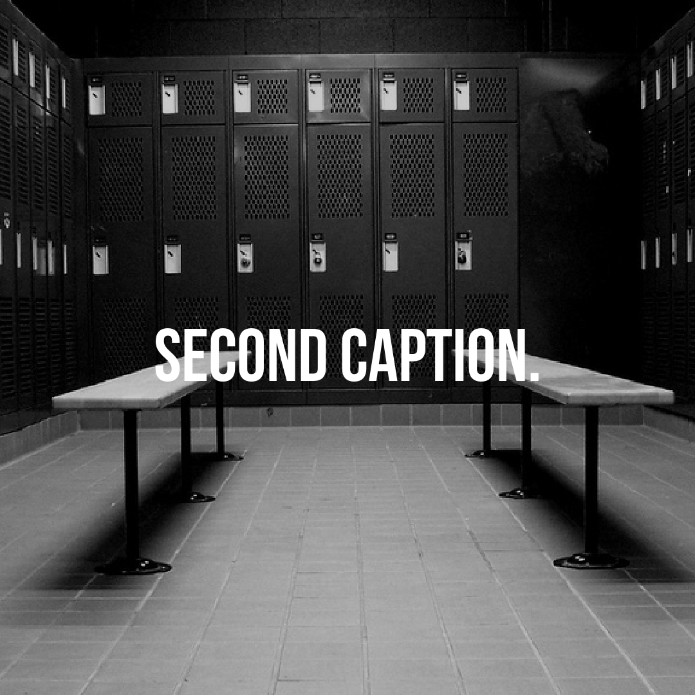
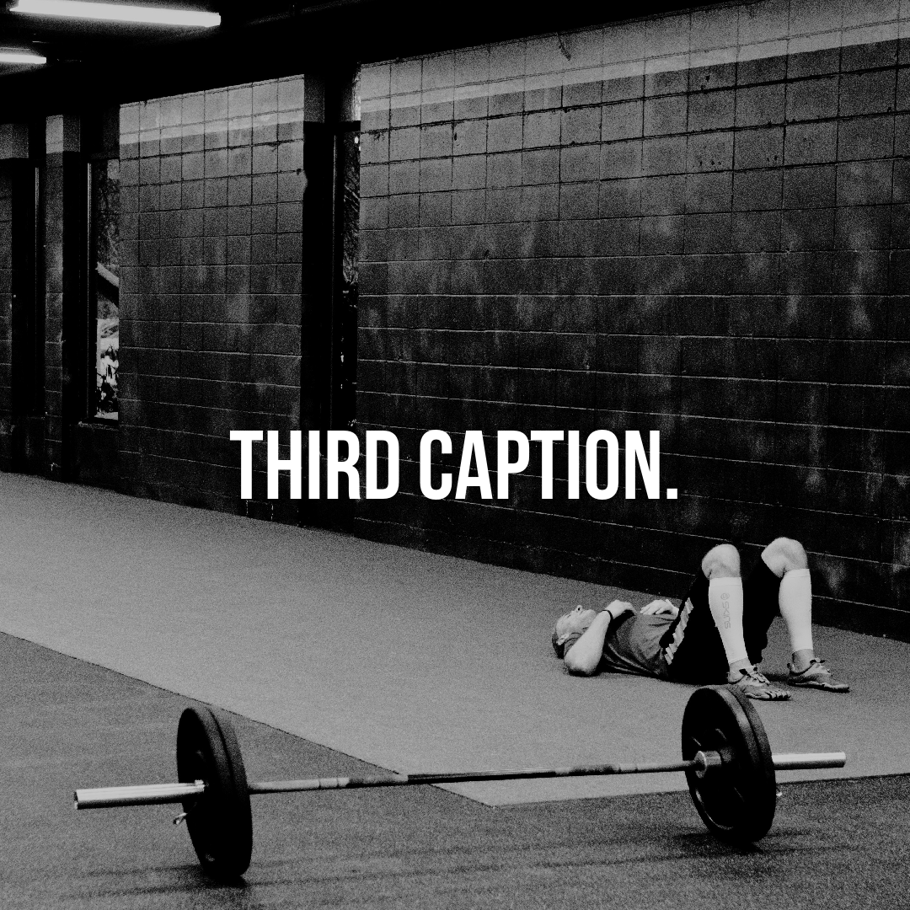
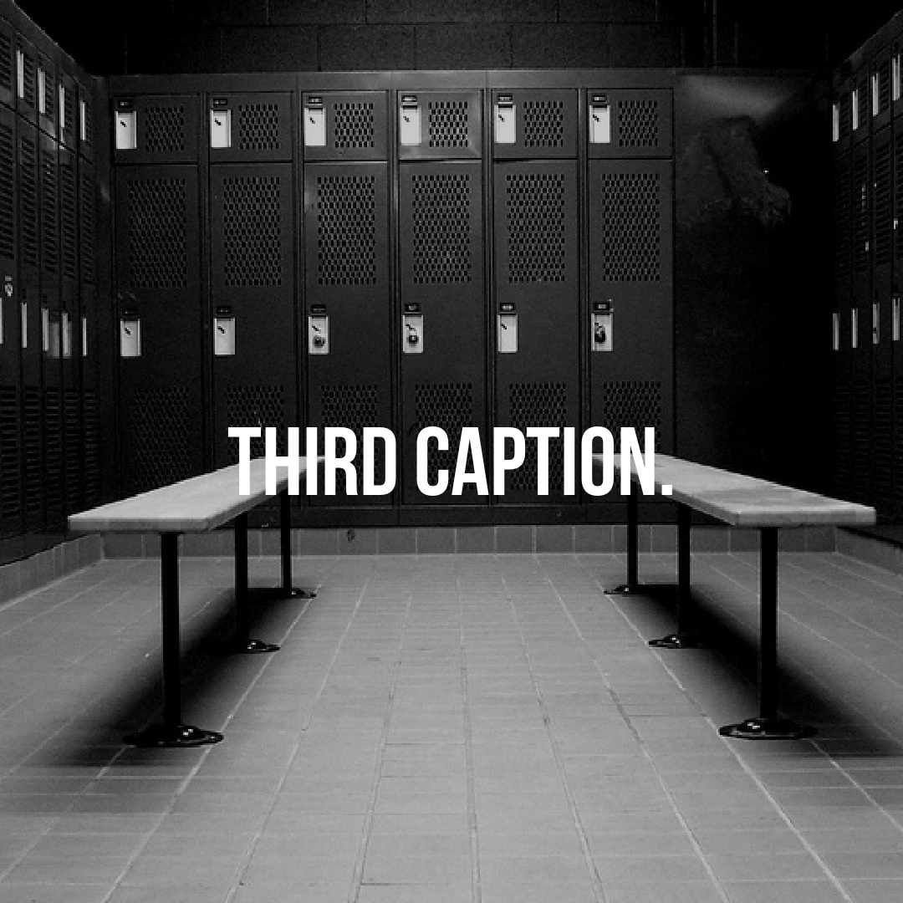
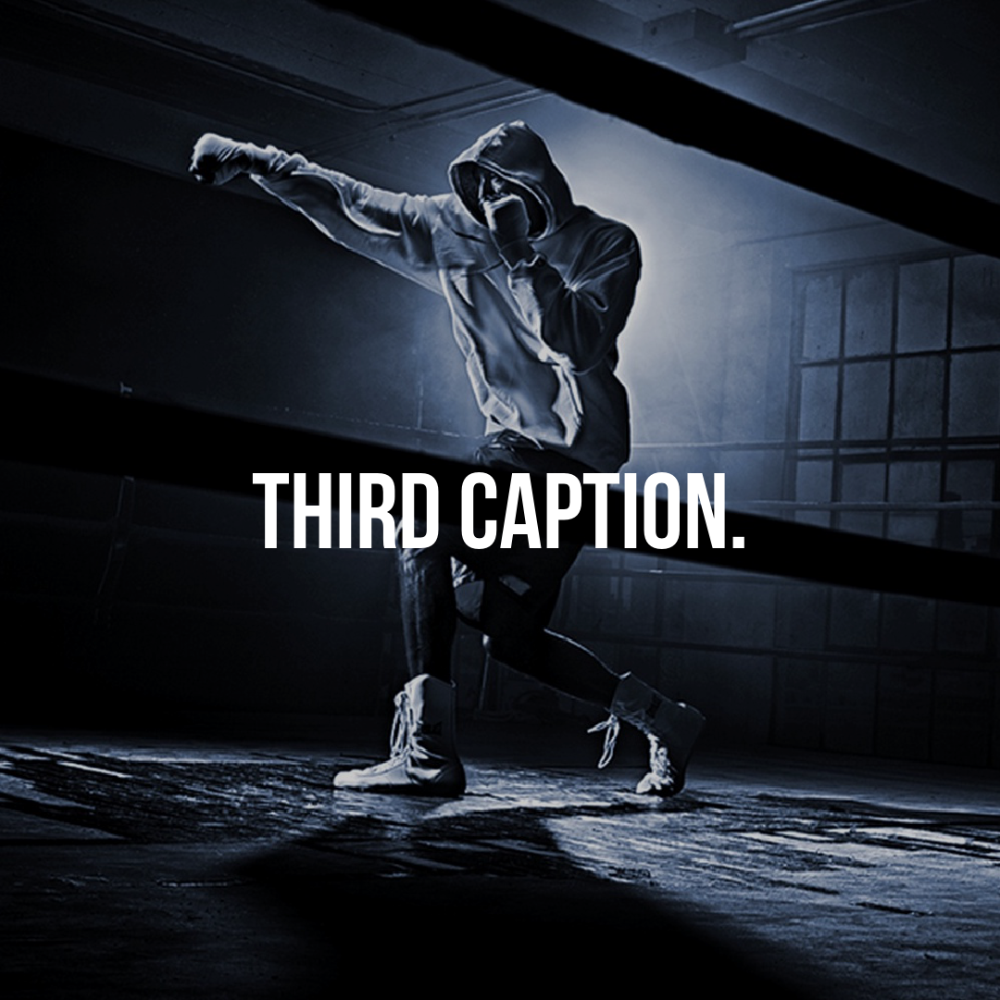

# captioners
Scripts to add text to images

### captioner.py

applies a black tint and captions a background image

**example:** *with* a logo/trademark

~~~
$ python captioner.py
Enter path of image to caption: in/bkg/bkg9.jpeg
Enter caption: Punching air can be tough
Include logo/trademark? (y/n): y
Output image saved as: out/out.png
~~~
  

input image *bkg9.jpg* and its output *out.png*

**example:** *without* a logo/trademark

~~~
$ python captioner.py
Enter path of image to caption: in/bkg/bkg8.jpg
Enter caption: Look at this empty locker room, i am so inspired.
Include logo/trademark? (y/n): n
Output image saved as: out/out.png
~~~

  

input image *bkg8.jpg* and its output *out.png*

### bulk-captioner.py

captions a number of images from the *in/bkg/* directory with captions from the *in/cap.txt* text file

**input files:** 

*cap.txt*

~~~
First caption.
Second caption.
Third caption.
~~~

*in/bkg/*

   

**example:** Generating pairings between an image and a caption

~~~
$ python bulk-captioner.py
Generate all permutations? (y/n): n
Include trademark/logo? (y/n): y
Captioning bkg10.jpg...
Output image saved as: out/_First capt.png
Captioning bkg8.jpg...
Output image saved as: out/_Second cap.png
Captioning bkg9.jpg...
Output image saved as: out/_Third capt.png
~~~

**output files:** 

    

This is helpful when I have captions that go with specific images.

However, most of the time I am bulk downloading images and captions so I want to generate all image/caption combinations and pick out the ones I like:

**example:** Generates all permutations of images with captions:

~~~
$ python bulk-captioner.py
Generate all permutations? (y/n): y
Include trademark/logo? (y/n): n
Captioning bkg10.jpg...
Output image saved as: out/0_First capt.png
Captioning bkg10.jpg...
Output image saved as: out/0_Second cap.png
Captioning bkg10.jpg...
Output image saved as: out/0_Third capt.png
Captioning bkg8.jpg...
Output image saved as: out/1_First capt.png
Captioning bkg8.jpg...
Output image saved as: out/1_Second cap.png
Captioning bkg8.jpg...
Output image saved as: out/1_Third capt.png
Captioning bkg9.jpg...
Output image saved as: out/2_First capt.png
Captioning bkg9.jpg...
Output image saved as: out/2_Second cap.png
Captioning bkg9.jpg...
Output image saved as: out/2_Third capt.png
~~~

**output files:**

We have three images and three captions so we get nine output images:
 
  

  
 
  
  
 
