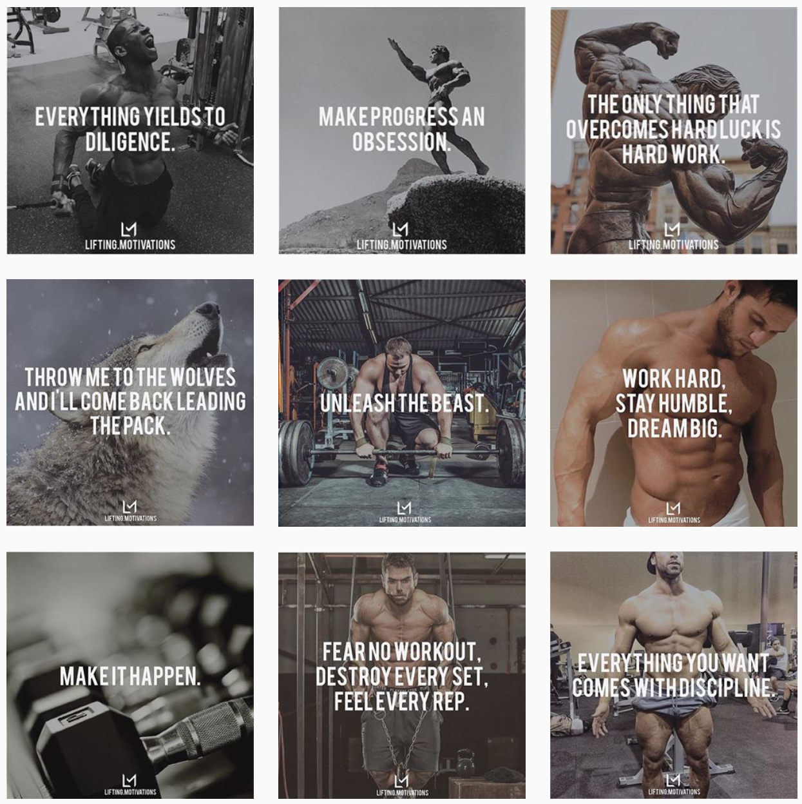

# Overlays

This project's goal is to automate the process of overlaying text onto images. Images to be overlayed with text are to be stored in the ```/in/bkg``` directory. The lines of text are to be stored in a text file ```cap.txt```.

## Motivation

A common design for a post on social media is an image overlayed with text. These types of posts show up a lot in niches aimed at self-motivation, specifically those concerned with physical fitness. 

If, say, an Instagram page aims at posting more than one image a day, then the task of creating these images can take up significant time. Formatting the image is especially tedious. One must make sure the text has the right font, font size and font colour as well as being centre-aligned on the image.

However, beyond the formatting, the recipe for these images is simple, it includes:

1. an image
2. a quote
3. a trademark (optional)
 
So one may see that it can be very beneficial yet straightforward to automate the process.

Below is a screenshot from one of my Instagram accounts geared at promoting personal motivation and fitness. Notice the identical formatting of the images, very automatable!




## Getting Started

Clone:
```https://github.com/evmarts/captioners.git```

Run the script:
```python captioner.py```

### Prerequisites

Python

## Built With

* Python Imaging Library (PIL)

## Examples

Consider the following images located in the ```in/bkg``` directory: 

   

and consider the following text file located in the ```/in``` directory:

*cap.txt*

~~~
First caption.
Second caption.
Third caption.
~~~

**output files:** 

    


#### Example 1 - overlaying images in order:
Suppose we want to overlay the first line of text with the first image, the second line of text with the second image and so on.

We would run the script, specifying that we do not wish to generate all combinations of the images and lines of text. 

~~~
evmarts$ python overlayer.py
Generate all permutations? (y/n): n
Include trademark/logo? (y/n): y
Overlaying bkg0.jpg...
Output image saved as: out/_First capt.png
Overlaying bkg1.jpg...
Output image saved as: out/_Second cap.png
Overlaying bkg2.jpg...
Output image saved as: out/_Third capt.png
~~~

#### Example 2 - generating all combinations of overlays:

Consider the same text file and the same three images as above. Perhaps we are unsure of what combination of image and text we would like to post. Indeed, some quotes go better with an image that others. 

Here, we will overlay each line of text with each image file in order to create all combinations of pairings. With all the possible final products generated we can later go through them all and decide which ones we like.

~~~
$ python bulk-captioner.py
Generate all permutations? (y/n): y
Include trademark/logo? (y/n): n
Captioning bkg10.jpg...
Output image saved as: out/0_First capt.png
Captioning bkg10.jpg...
Output image saved as: out/0_Second cap.png
Captioning bkg10.jpg...
Output image saved as: out/0_Third capt.png
Captioning bkg8.jpg...
Output image saved as: out/1_First capt.png
Captioning bkg8.jpg...
Output image saved as: out/1_Second cap.png
Captioning bkg8.jpg...
Output image saved as: out/1_Third capt.png
Captioning bkg9.jpg...
Output image saved as: out/2_First capt.png
Captioning bkg9.jpg...
Output image saved as: out/2_Second cap.png
Captioning bkg9.jpg...
Output image saved as: out/2_Third capt.png
~~~

## Authors

* **Evan Martin**

## License

This project is licensed under the MIT License - see the [LICENSE.md](LICENSE.md) file for details

## Acknowledgments

* Hat tip to anyone who's code was used
* Inspiration
* etc
